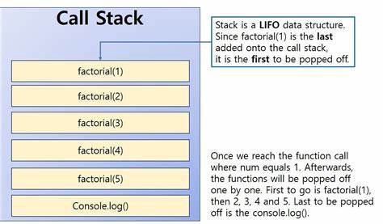
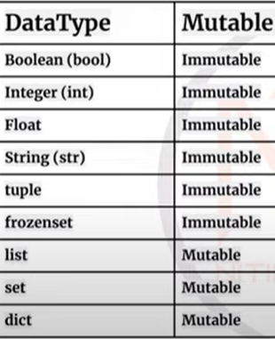

# General

## #1 List, Tuple and Set
- **Mutability:**
    - List and Set are mutable. Tuple is immutable
    - ***Although Sets are mutable,*** we cannot access or change any element of a Set via indexing or slicing. Hence, we can only add new elements into a set — not change them.
- Tuple and List support indexing and slicing, while Set does not.
```python
    fruit_list = ['🍎', '🍓', '🍐']
    fruit_list[1]
    # '🍓'

    animal_tuple = ('🐶', '🐱', '🐮')
    animal_tuple[2]
    # '🐮'

    vehicle_set = {'🚐', '🏍', '🚗'}
    vehicle_set[0]
    # TypeError: 'set' object is not subscriptable
```
- **Order of data**
    -  “Set and Dictionary are not ordered in Python.” Well, that is only half the truth today, depending on which version of Python you are using. 
    - Before Python 3.6, Dictionaries and Sets do not keep their insertion order, **BUT Starting from Python 3.7,** Dictionary and Set are officially ordered by the time of insertion.

- **Set**: 
    - Stores unique data only. If duplicate data stored, it will not be considered, it will simply ignore without an error.
    -  Set and Dictionary interchangeably bot are based on Hash Table (or Hash Map), and so finding value in set and key in dictionary is faster then list.
```python
this_set = {"apple", "banana", "cherry"}
if "apple" in this_set:
    print("Yes, 'apple' is in this set")
```   
- **Declaration**:
    - List: A comma-separated values (items) between square brackets [].
    - Tuple: Defined under parenthesis ().
    - Set: Initialize using `set()` constructor or curly brackets {}.
- **Summary**
    - If you need to store duplicates, go for List or Tuple.
    - For List vs. Tuple, if you do not intend to mutate, go for Tuple.
    - If you do not need to store duplicates, always go for Set or Dictionary. Hash maps are significantly faster when it comes to determining if an object is present in the Set (e.g. x in set_or_dict).
- **Resources**
    - https://jerrynsh.com/tuples-vs-lists-vs-sets-in-python/
    - https://www.w3schools.com/python/python_lists.asp
    - https://www.w3schools.com/python/python_tuples.asp
    - https://www.w3schools.com/python/python_sets.asp
    - [list_tuple_set.py](./list_tuple_set.py)


## #2 What is Decorator?
A decorator is just a function that takes another function as an argument, add some kind of functionality without changing in behavior of original function.
```python
import time
def time_logger(func):

    def func_executor(*args, **kwrargs):
        start_time = time.time()

        result = func(*args, **kwrargs)
        
        end_time = time.time()
        print("Taken time in seconds:", end_time - start_time)
        return result
    
    return func_executor


@time_logger
def long_running_fn(length):
    for i in range(length):
        print(i)
    return "done"

print(long_running_fn(10))
```

**Resources**
    - [decorator.py](./decoratory.py)


## #3 List, Dictionary, Set and Tuple Comprehension
Comprehensions provide a more compact and elegant way to create lists or dictionary by iterating over exiting dictionary or list.
```python
# List
even_numbers = [i for i in range(10) if i % 2 == 0] 

# Dictionary
even_numbers = { i: "Even" if i % 2 == 0 else "Odd" for i in range(10) }

# Set
even_numbers = set((i for i in range(10) if i % 2 == 0))

# GOTCHA: It creates generator object, not a SET 😦 
even_numbers = (i for i in range(10) if i % 2 == 0)

# For tuple comprehension, explicit tuple type casting is required 😧
even_numbers = tuple((i for i in range(10) if i % 2 == 0))
```


**Resources**
    - [comprehensions.py](./comprehensions.py)

## #4 How is Memory Managed In Python?
Memory management in Python involves a **private heap containing all Python objects and data structures**. The management of this private heap is ensured internally by the *Python memory manager*.

### Stack allocation:
**Stack** allocation stores the memory that is only needed inside a particular function or method call. When a function is called, it is added onto the program’s call stack. Any local memory assignments — such as variable initializations — inside the particular functions are stored temporarily on the function call stack, where it is deleted once the function returns, and the call stack moves on to the next task. This allocation onto a contiguous block of memory is handled by the compiler using predefined routines, and developers do not need to worry about it.



### Heap allocation:
Heap allocation stores memory that is used in the program, at global scope. These variables are needed outside of specific method or function calls or are shared within multiple functions globally. Unlike stack allocation, heap allocation is not related to its namely counterpart: the heap data structure. It is simply a large space of memory available for allocation and freeing at somewhat random addresses, found based on the space needed by the object being stored.

### Garbage collector does the job to remove unreferenced memory
Garbage collector uses a technique known as ‘reference counting’ in which objects are deallocated or “freed” when there is no longer a reference to it in the program.

**Resources**
- https://medium.datadriveninvestor.com/how-does-memory-allocation-work-in-python-and-other-languages-d2d8a9398543
- https://docs.python.org/2/c-api/memory.html


## #5 Difference Between Generators and Iterators
**Generators**

A generator is a type of function that returns a generator object, which can return a sequence of values instead of a single result. The def keyword is commonly used to define generators. At least one yield statement is required in a generator.
``` python
def nums():
   for i in range(1, 5):
       yield i

obj = nums()
print(next(obj))
print(next(obj))
print(next(obj))
print(next(obj))
```

**Iterators**
Python objects that iterate through iterable objects are called Iterators. It is used to iterate over objects by returning one value at a time. Iterators are created by using the iter() function. The function next() is used to get the subsequent value from the iterator.
``` python
nums = [1, 2, 3, 4]
obj = iter(nums)
print(next(obj))
print(next(obj))
print(next(obj))
print(next(obj))
```

**Resources**
- https://pythongeeks.org/python-generators-vs-iterators/
- https://stackoverflow.com/questions/2776829/difference-between-pythons-generators-and-iterators
- [generator_iterator.py](./generator_iterator.py)

## #6 What is 'init' keyword in python? __init__.py and __init__ in class!

**Resources**
- https://careerkarma.com/blog/what-is-init-py/
- https://stackoverflow.com/questions/448271/what-is-init-py-for

## #7 Difference Between Modules and Packages in Python

The module is a simple python file that contains collections of functions and global variables. We can import module like `import numpy`

The package is a directory having collection of module including `__inti__.py` file by which the interpreter interprets it as a package. THe package also contains sub-packages inside it.

Any module from the package can be imported as `from django.urls import path`

## #8 Difference Between Range and Xrange?

- Range returns list where Xrange returns generator
- As Xrange returns generator, it is taking less memory then Range
- Xrange not exist in python3
- If we want to 

## #9 What are inbuilt data types available in Python -OR Explain Mutable and Immutable data Types

```python
x = 5
y = x
print(x is y)   #>>>True | So y holds reference of x memory.
print(y)        #>>>5

x +=1
print(x is y)   #>>>False | now y is an object? Is that it? 
print(y)        #>>>5
```
The integer is immutable.

When you write x=5, x points to a memory location that holds 5.

When you go on and code y=x, the variable y points to the same location as x.

Then you type x+1=6, and now x points to a new location that holds 6, and not the previous location. ( Here, the integer still holds immutable because the original integer 5 still exists, but the variable x is not bound to it now. x is now bound to a new location. But y is still bound to the integer 5)

But y still points to the same location that holds 5.

So, integers are still immutable and this is how it works. To see it better, use id(x) or id(y) after every step.

**References**
- https://stackoverflow.com/questions/62177372/is-integer-immutable-or-mutable


# Essentials

## #1 Explain Ternary Operator in Python?
```python
i = 20
is_even_number = True if i % 2 == 0 else Fals
```

## #2 What is Inheritance In Python
The chid class acquires the properties and can access all the data member and functions defined in the parent class. A child class can also override specific functions implementation of the parent's class.
```python
class Vehicle:

    def drive(self):
        print("Regular mode driving speed")

    def wheels(self):
        print("4 wheels")

class BMW(Vehicle):

    def drive(self):
        print("Super speed driving mode")

class Maruti(Vehicle):
    pass

bmw = BMW()
bmw.drive()
bmw.wheels()

maruti = Maruti()
maruti.drive()
maruti.wheels()
```

## #3 Difference Between Local Variable and Global Variable in Python

## #4 Explain Break, Continue and Pass Statement

## #5  What is 'self' keyword in python?
Self parameter reference to the current instance of the class, and it is used to access variables and instance method of the clas.

## #6 Difference Between Pickling and Unpickling?

## #7 Explain type conversion in python. (int(), float(), ord(), oct(), str(), hex(), eval() etc.)
- `oct(45)` Returns octal representation of the integer in string
- `ord()` Returns the Unicode point of the character in the Unicode case or the bytes values in the case of the an 8-bit argument.
- `eval('1+2+3') => output:6` Parse the expression argument and evaluates it as python expression.
- `repr()` ?

## #8 What does *args and **kwargs mean?
If a function define argument as *args, then any number of argument can be passed to that function, and all the argument will be accessed by args as a tuple.

The **kwargs argument is a dictionary argument, kwargs is the abbreviation of key word arguments. It means all the function keyword value pair arguments can be accessed use kwargs as a dictionary.

### Interesting operations:
- Use * To Extract Part Of A Python List.
    ``` python
    >>> x,*y,z = [1,2,3,4,5,6]
    >>> print(x)
    1
    >>> print(y)
    [2, 3, 4, 5]
    >>> print(z)
    6
    ```
- Use * To Pass List Argument To Python Function.
    ```python
    # first define a python list variable.
    >>> args = [1,2,3,4,5,'python']
    # invoke test_arg function and pass above list values. use *args to extract the list values.
    >>> test_arg(*args)
    1
    2
    3
    4
    5
    python
    ```

 **Resources**
 - [args_kwargs.py](./args_kwargs.py) 
 - https://www.dev2qa.com/what-is-the-difference-between-args-and-kwargs-in-python/
 - https://www.codevscolor.com/args-kwargs-python-difference

## #9 What is "Open" and "With" statement in python? 
with statement in Python is used in exception handling to make the code cleaner and much more readable. It simplifies the management of common resources like file streams, database connections etc... 

File stream operations required to close stream after usage to avoid memory overflow, exception likes "File is being used by another operations" etc..
Check the following example, 1st example is a bad practice to do file operation as if any error occurred after opening the file, file will never be get a chance to close its stream and it could lead issues. Better practice is 2nd and 3rd code example, and 3rd code example is much more easy to read and less to maintain.

As soon as with block execution is finished, file stream connection is closed automatically even any exception occurred inside the with block.

We can also achieve similar functionality using the **Context Manager** to release expensive resources after the usage.  

```python
# 1. Bad practice  
f = open("./context_manager.py")
data = f.read()
# Place for the other logic to run
f.close()

# 2. Batter practice  
f = None
try:
    f = open("./context_manager.py")
    data = f.read()
    # Place for the other logic to run
finally:
    if f:
        f.close()

# 3. Batter and much more cleaner way close file stream
with open("./context_manager.py") as f:
    data = f.read()
    print(data)
```

**Resources**
- https://www.geeksforgeeks.org/with-statement-in-python/
- [context_manager.py](./context_manager.py)

## #10 Explain usage of Context Manager
Context managers allow you to allocate and release resources precisely when you want to. The most widely used example of context managers is the with statement. A common use case of context managers is locking and unlocking resources and closing opened files.
```python
class FileManager():
	def __init__(self, filename, mode):
		self.filename = filename
		self.mode = mode
		self.file = None
		
	def __enter__(self):
		self.file = open(self.filename, self.mode)
		return self.file
	
	def __exit__(self, exc_type, exc_value, exc_traceback):
		self.file.close()

# loading a file
with FileManager('test.txt', 'w') as f:
	f.write('Test')
```

**Resources**
- https://www.geeksforgeeks.org/context-manager-in-python/
- [context_manager.py](./context_manager.py)

## #11 Different modes to read and write a file?
- r for reading – The file pointer is placed at the beginning of the file. This is the default mode.
- r+ Opens a file for both reading and writing. The file pointer will be at the beginning of the file. Old change in the file will be overwrite.
- w Opens a file for writing only. Overwrites the file if the file exists. If the file does not exist, creates a new file for writing. Old change in the file will be overwrite.
- w+ Opens a file for both writing and reading. Overwrites the existing file if the file exists. If the file does not exist, it creates a new file for reading and writing.
- rb Opens a file for reading only in binary format. The file pointer is placed at the beginning of the file. Old change in the file will be overwrite.
- rb+ Opens a file for both reading and writing in binary format.
- wb+ Opens a file for both writing and reading in binary format. Overwrites the existing file if the file exists. If the file does not exist, it creates a new file for reading and writing.
- a Opens a file for appending. The file pointer is at the end of the file if the file exists. That is, the file is in the append mode. If the file does not exist, it creates a new file for writing.
- ab Opens a file for appending in binary format. The file pointer is at the end of the file if the file exists. That is, the file is in the append mode. If the file does not exist, it creates a new file for writing.
- a+ Opens a file for both appending and reading. The file pointer is at the end of the file if the file exists. The file opens in the append mode. If the file does not exist, it creates a new file for reading and writing.
- ab+ Opens a file for both appending and reading in binary format. The file pointer is at the end of the file if the file exists. The file opens in the append mode. If the file does not exist, it creates a new file for reading and writing.
- x open for exclusive creation, failing if the file already exists (Python 3)

## #12 What is Pythonpath?

## #13 How exception handled in Python. [Try, Except, Else And Finally Block]

## #14 Difference Between Python 2.0 & Python 3.0

## #15 What is PIP in python

## #16 Where is Python used?

## #17 How to use F string and format or replacement operator in Python?

## #18 How to get list of all keys in a dictionary?

## #18 Difference Between Abstration and Encapsulation.


# Specialist

## #1 Does Python support multiple inheritence. (Diamond Problem)

## #2 How to initialize empty List, Tuple, Dict or Set?

## #3 What are .py and .pyc files in Python

## #4 How slicing works in string manupulation. Explain [::-1]

## #5 Can you concatenate two tuples? How is it even possible to concatenate two tuples, since Tuple is Immutable data type.

## #6 Difference Between Python Arrays and Lists

## #7 Difference Between _a, __a, __a__ in python?

## #8 How to read multiple value from single input? --- By Split()

## #9 How to copy and delete a dictionary
```python
import copy

thisdict = {
  "brand": "Ford",
  "model": "Mustang",
  "year": 1964,
  "person": {
      "name": "Priyank",
      "location": "US",
      "state": "LA",
  }
}

# Way1, Way2 and Way3 do the shallow copy.
# Way4 is deep copy

# Way1
mydict = thisdict.copy()

# Way2
#mydict = dict(thisdict)

mydict["brand"] = "Hyundai"
mydict["person"]["name"] = "Richa"

# Way3
mydict = copy.copy(thisdict)
mydict["person"]["location"] = "India"

# Way4
mydict = copy.deepcopy(thisdict)
mydict["person"]["state"] = "Guj"

print(thisdict)
print(mydict)
```

## #10 Difference Between Anonymous and Lambda function

# Exprert

## #1 How to achieve Multiprocessing and Multithreading in python?

## #2 What is GIL. Explain

## #3 How class and object created in python?

## #4 Explain Namespace and its types in python

## #5 Explain Recursion by Reversing a list.

## #6 What are Unittests in Python

## #7 How to use Map, filter and reduce functions in python?
```python
from functools import reduce

list1 = [*range(10)]

# Filter
odd_nrs = [*filter(lambda x : x%2!=0, list1)]
print(odd_nrs)

#Map
nums = [*map(lambda x : x * x, list1)]
print(nums)

#Reduce
reducer_num = reduce(lambda x,y:x+y, list1)
print(reducer_num)

#Polyfill of filter
def myfilter(func, list):
    result = []
    for l in list:
        if func(l):
            result.append(l)
    return result

even_nrs = [*myfilter(lambda x:x%2==0, list1)]
print(even_nrs)
```

## #8 Difference Between Shallow copy and deep copy
In simple term, shallow copy does not copy the object resides in nested level, so if you change the value of nested object after the shallow copy, it will changs the value of original object.

While deep copy drill down the object in any hierarchy level and give complete copy of the object. 

```python
import copy
# Shallow copy
mydict = copy.copy(thisdict)
mydict["person"]["location"] = "India"


# Deep copy
mydict = copy.deepcopy(thisdict)
mydict["person"]["state"] = "Guj"

print(thisdict)
print(mydict)
```

## #9 How an object be copied in python

## #10 What does term MONKEY PATCHING refer to in python?

## #11 What is operator overloading & Dunder/Magic Method.

Dunder / Magic methods : – Those methods which are starts with double underscore and ends with double underscores are called Dunder or Magic methods. These methods are very special methods. There are so many dunder methods from which today we are going to see some important methods that are commonly used.

Ex – __str__(self), __repr__(self), __init__(self), __add__(self, other), __sub__(self, other), __mul__(self, other).

- __init__(self) :– As we already know about __init__(self) and also its works. it is basically a constructor. Constructor means when the objects is created it is automatically called.

- __str__(self) :- This is a string method This will use to print the string in a format that understand by the users.

- __repr__(self):- This is a representation method. This is also same as __str__() method but this is basically use while debugging.

```python
class example:
 
    def __init__(self,name,city):
        self.name = name
        self.city = city
 
    def __str__(self):
        return f"My name is {self.name} and i live in {self.city}"
 
    def __repr__(self):
        return f"example('{self.name}','{self.city}')"
     
     
    ex1 = example("asif","lucknow")
     
    # this is the another method to call it does the same thing
     
    print(str(ex1))
    >> My name is asif and i live in lucknow
     
    print(repr(ex1))
    >> example('asif','lucknow')
```

Operator overloading with Dunder methods :- Operator overloading means using same operator for different use like add to numbers or add two string.

- __add__(self, other): This method is use to add two values ( like it can be integer float or string) this is used for operator overloading.

- __sub__(self, other): It is used for substraction

- __mul__(self,other): It is use for multiplication

- __len__(self) :- This method is use to find the length of a string or length of a list.

There are so many methods for operator overloading . These are most common used methods for overloading.

 **Resources**
- https://codeupon.wordpress.com/2021/02/14/dunder-magic-method-and-operator-overloading/

```
class calculation:
    def __init__(self,num1):
        self.num1 = num1
 
    def __add__(self, other):
        return self.num1 + other.num1
 
    def __sub__(self, other):
        return self.num1 - other.num1
 
    def __mul__(self, other):
        return self.num1 + other.num1
 
    def __len__(self):
        return len(self.num1)
 
 
n1 = calculation(43)
n2 = calculation(54)
print(n1 + n2) >> 97
print(n1 - n2) >> -11
print(n1 * n2) >> 97
 
# This is also use for string
s1 = calculation("Hello")
s2 = calculation("World")
print(s1 + s2) >> HelloWorld
 
#now len is use the find the length of objects
f1 = calculation("this is a string") 
print(len(f1)) >> 16
```


## #12 Draw Some Pattern/Graphs.

